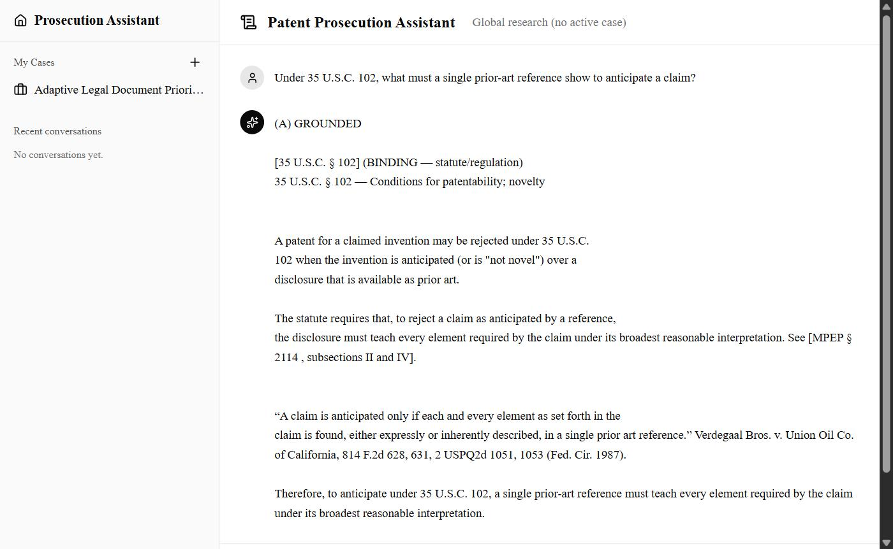
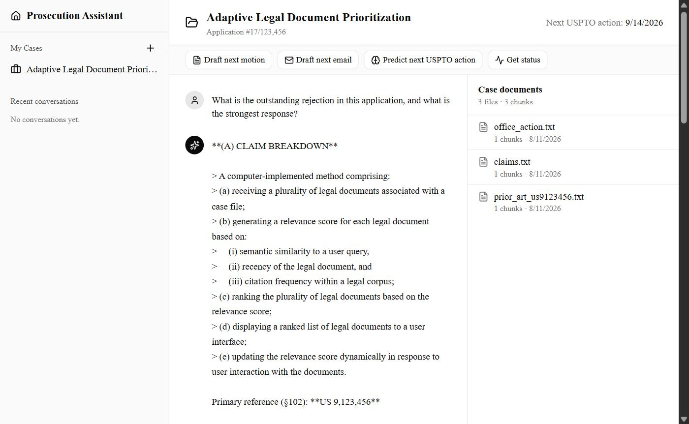
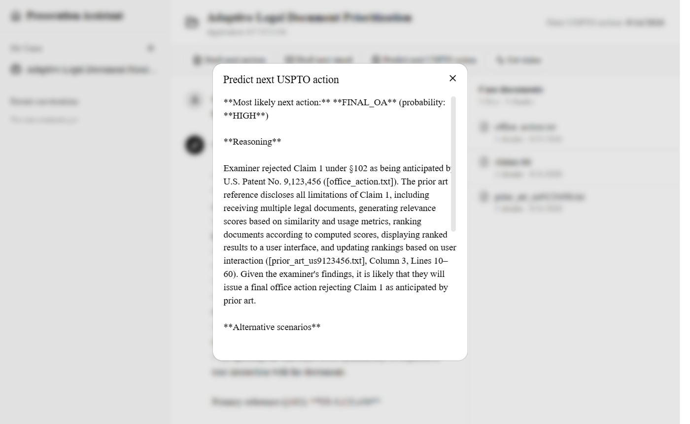

# Patent Prosecution Assistant

Patent Prosecution Assistant is a ChatGPT-style research tool for patent prosecutors built with Next.js and local Ollama. It combines a per-case workspace and document upload with grounded retrieval over a public-domain corpus of MPEP, 35 U.S.C., 37 C.F.R., PTAB, and Federal Circuit text, plus predefined actions that return structured drafts and predictions.

## About

A general-purpose chatbot answers patent-law questions fluently and wrongly, inventing section numbers that sound right. This project takes the opposite bet: retrieve first from the actual public-domain text, then answer only from what came back. Retrieval picks the answer mode, not the model. GROUNDED when sources exist, with each assertion labeled `BINDING` for statute and regulation or `PERSUASIVE` for MPEP guidance; FRAMEWORK only when retrieval returns nothing, so a gap is stated rather than filled.

Everything runs on local Ollama, so no LLM API keys are required and no client document leaves the machine.

## What's New

- Structured analyzers for rejections, motions, next-action prediction, and case status, returning typed objects instead of prose
- Grounding fix so a case keeps its own documents in context instead of being pushed out by the global corpus
- Global-corpus fetchers for 35 U.S.C., 37 C.F.R., PTAB, and Federal Circuit, joining the existing MPEP fetcher
- Prior-art mapping that grades each claim limitation and downgrades any finding whose quote cannot be matched verbatim in the reference
- USPTO Open Data Portal client with a 24h TTL cache
- Eval harnesses, diagnostic scripts, and test fixtures for the analyzers
- Chat model moved to Llama 3.1 8B and the whole stack moved off hosted inference to local Ollama

## Core Features

- Create a case, upload its documents, and have them chunked and embedded automatically
- Ask questions answered from retrieved text, with a source label on every assertion
- Search the case's own documents and the global corpus together, or research the corpus alone
- Draft the next motion, draft the next client email, predict the next USPTO action, and get case status
- Seed the corpus from official sources with per-fetcher dry-run and idempotent reseed flags
- Look up live application data from the USPTO Open Data Portal

## Tech Stack

- Next.js 16 and React 19
- TypeScript
- Tailwind v4 and shadcn/ui
- Vercel AI SDK v6
- Drizzle ORM
- Postgres with pgvector
- Local Ollama (Llama 3.1 8B chat, mxbai-embed-large embeddings at 1024 dims)
- Cloudflare R2, with a local filesystem fallback
- USPTO Open Data Portal

Swapping to a hosted provider is a two-file change: `src/lib/llm.ts` and `src/lib/embed.ts`.

## Screens

Live captures of the running app, not mockups: local Llama 3.1 8B over a pgvector corpus of MPEP §§ 2131/2143 and the 20 most-cited 35 U.S.C. sections, plus three uploaded case documents.

### Global Research

Retrieval over the global corpus only, with no active case. Answers open with the source label the system prompt assigns.

<p align="center">
  
</p>

### Case Workspace

Per-case view with the predefined-action bar, a document panel showing per-file chunk counts, and a chat that searches the case's own documents alongside the global corpus.

<p align="center">
  
</p>

### Predefined Actions

`Predict next USPTO action` returns a typed prediction covering action, probability, reasoning, and alternatives, with each finding attributed to the case document it came from.

<p align="center">
  
</p>

## Project Structure

- `src/app/`: Next.js App Router routes, server actions, and API handlers
- `src/lib/`: retrieval, prompts, chunking, embeddings, chat model, and the USPTO client
- `src/lib/prompts.ts`: GROUNDED / FRAMEWORK / OUT-OF-SCOPE system prompts
- `src/lib/rag.ts`: pgvector cosine retrieval, filtered by case
- `src/lib/db/schema.ts`: Drizzle schema, where the chunks table is the vector store
- `scripts/ingest/`: corpus fetchers and the shared embedding pipeline
- `scripts/uspto/`: Open Data Portal smoke tests
- `backlog.txt`: ordered work list
- `docs/screenshots/`: README images

## Running Locally

1. Start Postgres with pgvector:
   ```bash
   docker run -d --name patent-pg -p 5432:5432 \
     -e POSTGRES_PASSWORD=dev pgvector/pgvector:pg16
   ```
   [Neon](https://neon.tech) works too: free, and it supports pgvector.

2. Start Ollama and pull the models (~5.4 GB on disk):
   ```bash
   brew services start ollama
   ollama pull llama3.1:8b           # chat model
   ollama pull mxbai-embed-large     # embeddings (1024 dims)
   ```

3. Configure the environment and push the schema:
   ```bash
   cp .env.example .env.local        # fill in DATABASE_URL, USPTO_ODP_KEY, R2 keys
   npm install
   npm run db:push
   ```

4. Run the dev server at http://localhost:3000:
   ```bash
   npm run dev
   ```

## Seeding the Global Corpus

Retrieval only works well once the corpus is seeded. Every fetcher supports `--dry-run` to preview without DB writes and `--clear-existing` for idempotent reseeds.

```bash
# MPEP, current USPTO HTML
npm run ingest:mpep -- --section 2131 --clear-existing
npm run ingest:mpep -- --chapter 2100 --clear-existing

# 35 U.S.C., Cornell LII
npm run ingest:usc  -- --core --clear-existing          # 20 most-cited sections
npm run ingest:usc  -- --part II --clear-existing       # entire Part II (patentability)

# 37 C.F.R., eCFR Versioner API
npm run ingest:cfr  -- --clear-existing                 # default parts 1, 11, 41, 42
npm run ingest:cfr  -- --part 1 --clear-existing

# PTAB precedential / informative decisions, PDF
npm run ingest:ptab -- --designation precedential --clear-existing
npm run ingest:ptab -- --filter "Aqua|Apple"

# Federal Circuit opinions, PDF (most-recent ~25 only)
npm run ingest:fed-circuit -- --limit 5 --clear-existing
npm run ingest:fed-circuit -- --origin all

# Local .txt / .md files into the global corpus
npm run ingest:local -- --path ./corpus/mpep-2106.txt --doc-type mpep --citation "MPEP 2106"
```

Source choices, where they are not obvious: Cornell LII for U.S.C. because uscode.house.gov is JSF-rendered; eCFR for C.F.R. via the documented JSON/XML versioner API; www.cafc.uscourts.gov for Federal Circuit because CourtListener now requires an API token. Details in `memory/corpus-source-decisions.md`.

## USPTO Open Data Portal

`USPTO_ODP_KEY` in `.env.local` unlocks the file-wrapper endpoints (`/applications/{n}/meta-data`, `/documents`, search). Smoke-test a key without printing it:

```bash
npm run uspto:status -- --application 18045436
```

## Backlog

`backlog.txt` at the repo root is the ordered, in-place status list, prefixed `[DONE]`, `[WIP]`, or `[TODO]`. It mirrors a live kanban board on EC2 (panini board id=2). When you start or finish an item, update both `backlog.txt` and the board using the helpers in `scripts/kanban/`, which are gitignored.

Next up: citation verification post-pass, reranker over top-50 retrieval, conversation memory.

## Notes

- Working prototype, single-user. Auth is a hardcoded stub and the Auth.js v5 swap-in is backlogged.
- Chat has no memory across turns yet. Retrieval runs on the last user message, not the full conversation.
- There is no citation-verification pass yet, so the 8B model still emits the occasional section number that is not in the retrieved set.
- Assistant output renders as plain text, so Markdown in a response shows literally. Visible in the screenshots above.
- FRAMEWORK mode is deliberately binary. It fires only when retrieval returns zero sources, after an earlier version dropped into it whenever any single load-bearing document was missing.

## License

Private / not yet licensed.
